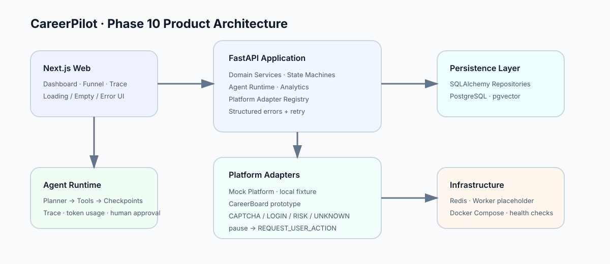
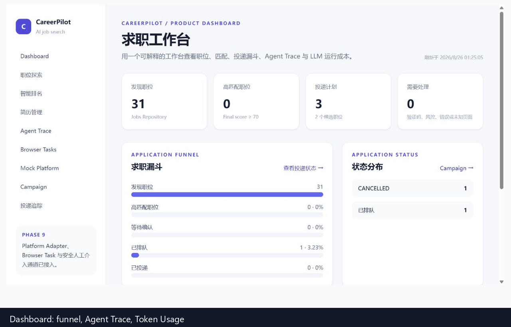
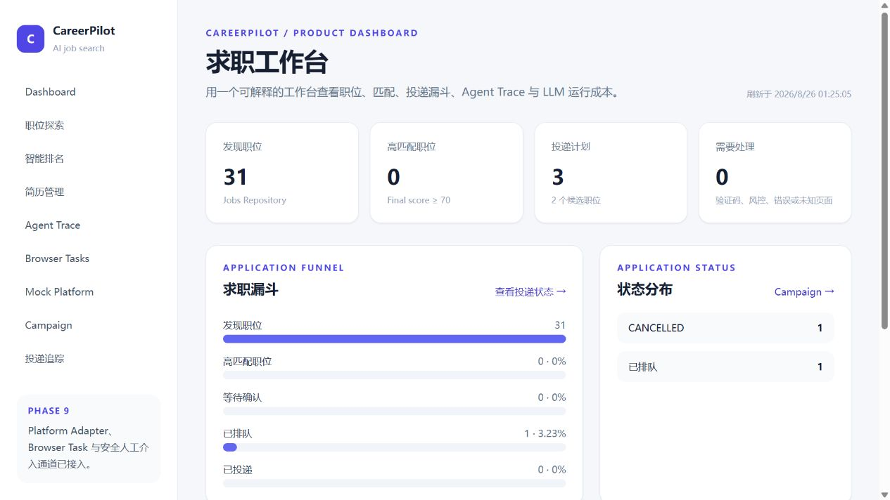
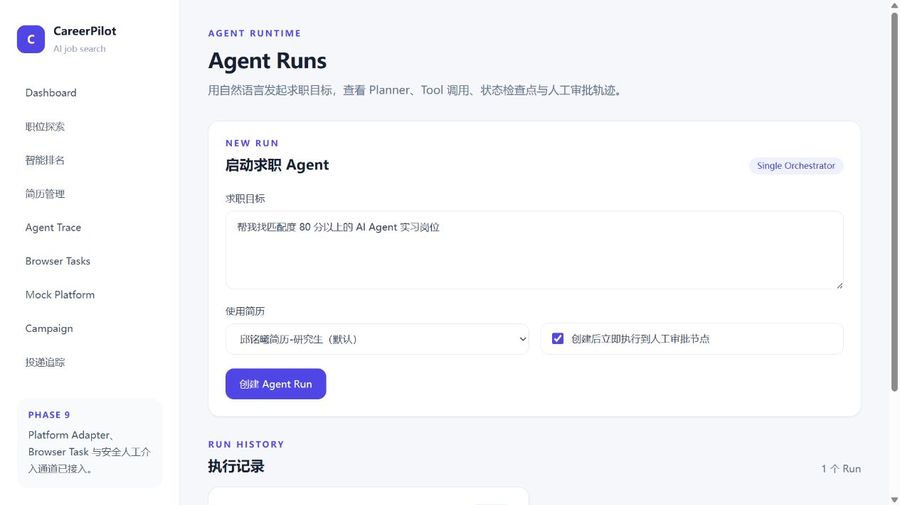
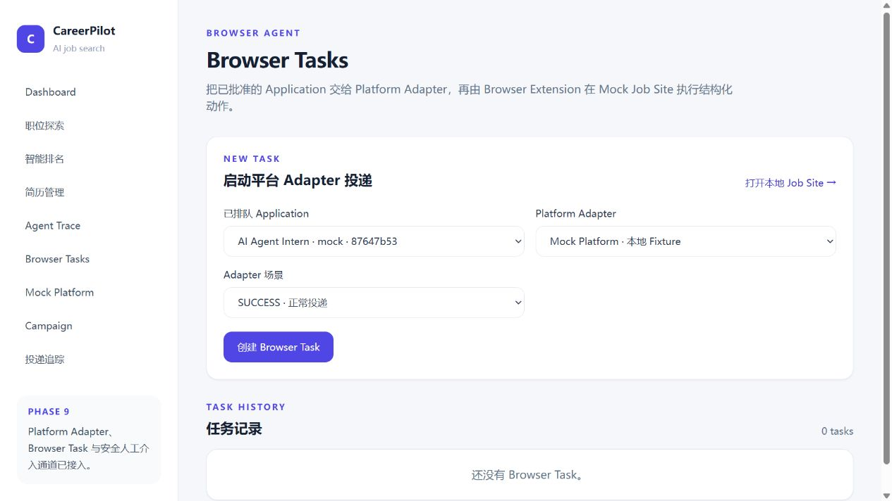

# Phase 10 — Productization

## Product surface

The Dashboard is now backed by `GET /api/dashboard` and presents one read-only product view for:

- Jobs, high-match jobs, Campaign candidates, Application attention states.
- Application Funnel: discovered → high match → approval → queued → submitted.
- Agent Trace quality: active/completed/failed runs, steps, retries, and average latency.
- LLM Token Usage: prompt/completion/total tokens and cost status.

The API uses `DashboardRepository → DashboardService → DashboardRead`; the router does not query SQLAlchemy directly.

## Retry and error handling

Agent execution already retries individual tool calls according to `max_retries`. Phase 10 exposes terminal recovery with `POST /api/agent-runs/{id}/retry`, which creates a new auditable Run and stores `input.retry_of`. The original failed Run is preserved.

The UI has explicit loading, empty, and error states on Dashboard, Agent Runs, Campaigns, Applications, Jobs, Resume, Ranking, and Browser Tasks. High-risk Browser Adapter states remain human-gated.

## Token and cost semantics

`LLMUsage` is provider-aware. Providers that return usage can report billable cost; the local `MockLLMProvider` reports a clearly labelled token estimate and no billable dollar amount. The UI therefore shows `未计费` instead of inventing a price.

## Architecture Diagram

## Demo GIF

The GIF sequences real local screenshots of Dashboard, Agent Trace, and Browser Tasks. The animated SVG remains available as a lightweight architecture-independent workflow artifact. The live flow is available at [Dashboard](http://localhost:3000/dashboard), [Agent Runs](http://localhost:3000/agent-runs), and [Browser Tasks](http://localhost:3000/browser-tasks) after `docker compose up`.

## Screenshots / local visual verification

The product surfaces were verified against the running local Docker stack:

The corresponding routes are `http://localhost:3000/dashboard`, `http://localhost:3000/agent-runs`, `http://localhost:3000/applications`, and `http://localhost:3000/browser-tasks`.

The screenshots are local-only and contain no external recruitment account data.

## Technical highlights

- Explicit boundaries: Web → API → Service → Repository → PostgreSQL/Redis.
- Cost-aware ranking narrows candidates before the LLM Judge stage.
- Resume RAG evidence is attached to score decisions and visible in Trace.
- Agent state, steps, events, retries, human approval, and Browser actions are persisted.
- Platform-specific selectors, parser, detector, and actions are isolated per Adapter.
- High-risk browser conditions pause and emit `REQUEST_USER_ACTION`; no bypass behavior exists.
- Docker Compose runs API, Web, Worker, PostgreSQL, and Redis with health checks.

## Interview talking points

1. Why is the Agent Runtime a single orchestrator? It keeps domain decisions in Services and makes tool execution, checkpoints, retries, and approval easy to audit before any future multi-agent split.
2. How is LLM cost controlled? Rule filtering, embedding retrieval, reranking, and top-K LLM judging reduce expensive calls; token telemetry distinguishes provider billing from local estimates.
3. How do you make browser automation safe? The Adapter owns platform differences, only receives structured actions, uses a user-launched browser session, and pauses on CAPTCHA, login, risk control, or unknown DOM.
4. How is failure recovery designed? Tool retries are bounded by `max_retries`; terminal Agent failures create a new Run through Retry, preserving the original trace.
5. How is the system testable? Deterministic MockLLM, Mock Platform, local Browser Task protocol, API tests, strict TypeScript, lint, and Docker smoke checks cover the main paths without external credentials.
